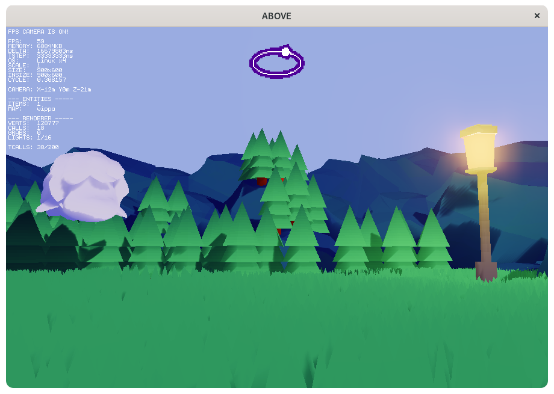

 

 

[Youtube](https://youtu.be/sVQhsT1TEOA)

# How to build:
The built binaries will end up on `out/`.

- ## Linux (Appimage, GLIBC 64 bits):
    **Requirements:** Linux/WSL (GLIBC), WGET, Make, Appimagetool, zip, rsync, git

    Command:

        git clone https://github.com/darltrash/above
        cd above
        make appimage

- ## MacOS **(BETA)**:
    **Requirements:** MacOS, Make, zip, rsync, git

    This is in beta mostly because macOS doesn't trust my game :(

    Command:

        git clone https://github.com/darltrash/above
        cd above
        make mac

- ## Windows (x86 and x86_64):
    **Requirements:** Some posix-esque interface, WGET, Make, zip, unzip, rsync, git

    Command:

        git clone https://github.com/darltrash/above
        cd above
        make win32 # change to win64 if you want 64 bit binaries

- ## Everything else:
    **Requirements:** Some posix-esque interface, Make, zip, rsync, git

    This will generate a .love file you can open up using [Löve](https://love2d.org).

    Command:

        git clone https://github.com/darltrash/above
        cd above
        make love

# How to run without building:
- Fetch a binary from the itch.io page

- Install Löve from love2d.org or a package manager, 
    Download this repo as a zip and rename it from .zip to .love,
    Execute the .love file with Löve

It is recommended to build or use a pre-built binary instead of
running this project as-is, because it contains tons of "bloaty"
things that only serve a purpose for development; such things
being deleted in the built versions of this game.

# Useful environment variables:
To control above's engine directly you can use a set of specific
environment variables, such as:

| Environment var.   | Type      | Description                                             |
|--------------------|-----------|---------------------------------------------------------|
| `ABOVE_LOW_END   ` | `Boolean` | Enables hardware potato mode                            |    
| `ABOVE_DEBUG     ` | `Boolean` | Enables debug mode, does not work on release binaries   |       
| `ABOVE_FPS       ` | `Boolean` | Enables FPS counter :)                                  |      
| `ABOVE_LINEAR    ` | `Boolean` | Enables linear interpolation for textures, don't enable |
| `ABOVE_VOLUME    ` | `Number ` | Sets the audio volume                                   |     
| `ABOVE_FULLSCREEN` | `Boolean` | Sets the default fullscreen mode                        |         
| `ABOVE_SCALE     ` | `Number ` | Sets the size of each pixel squared                     |     
| `ABOVE_VSYNC     ` | `Number ` | Sets VSYNC (0: No VSYNC, 1: Normal, 2: Half, etc)       |
| `ABOVE_LEVEL     ` | `String ` | Sets the bootup level, requires ABOVE_DEBUG to be true  |

This programs respects the [`NO_COLOR` directive](https://no-color.org/).